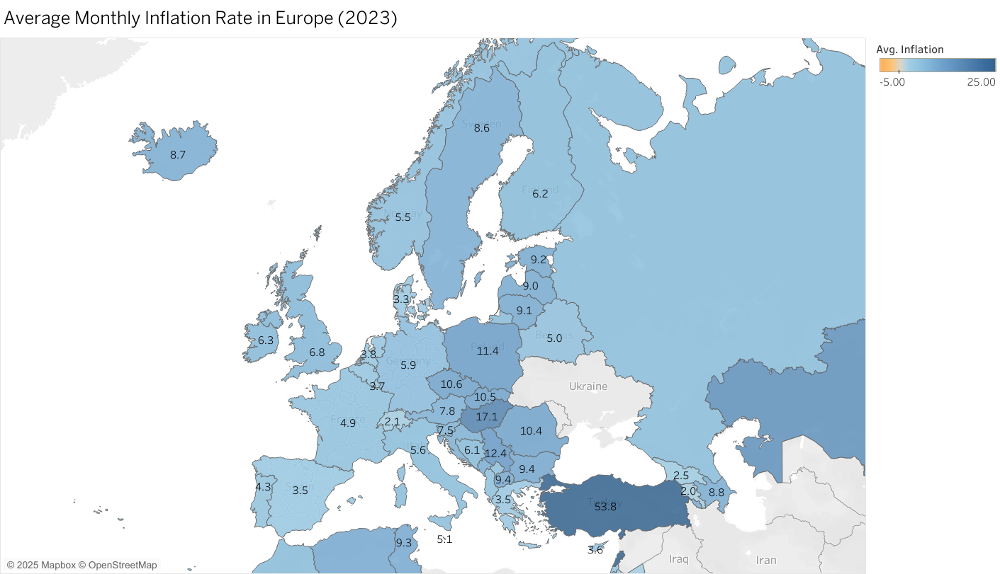

# 🌐 Live Dashboard
https://public.tableau.com/app/profile/jan.eljasiak/viz/Inflation2023EU/Sheet1?publish=yes

# Market-Expansion-Dashboard
A Tableau dashboard project visualizing inflation trends across European countries to support strategic business decisions on regional market expansion. Includes static comparative maps, slope charts, and data transformation steps using Python, SQL and Excel.

# 📊 Targeting Growth: A Data-Driven Dashboard for Regional Market Expansion Decisions

This project presents a **Tableau dashboard** designed to help businesses identify attractive European markets for expansion by analyzing and visualizing **inflation trends** across countries over time.

## 🧭 Objective

To provide business leaders and analysts with a **clear, comparative view of inflation rates** in Europe and how they have changed in recent years, supporting decisions around **market entry, pricing strategy**, and **regional growth potential**.

---

## 📌 Key Features

- 🗺️ **Choropleth Maps**: Static comparative maps showing inflation rates in European countries for selected years (e.g., 2015 vs 2023)

